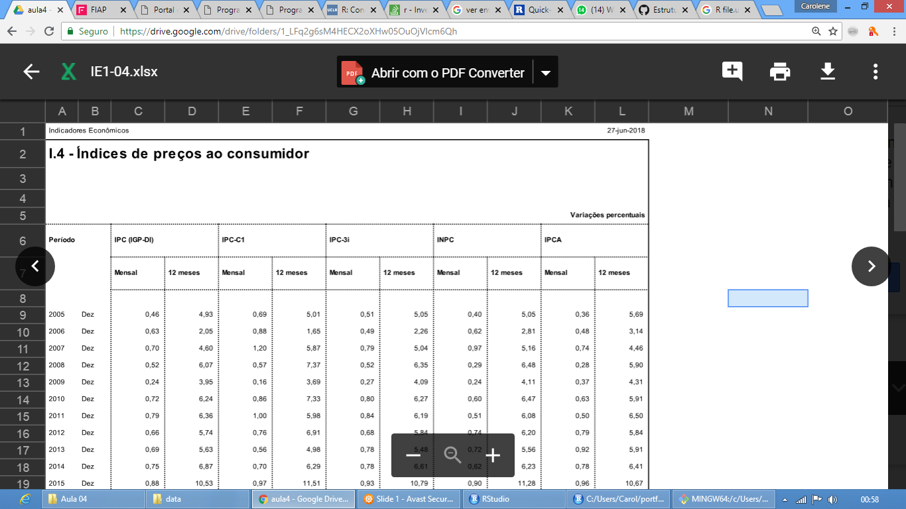

```{r setup, include=FALSE}
knitr::opts_chunk$set(echo = TRUE)
```

## Exercício de download

**1. O que faz cada uma das instruções do exemplo?**
A função `file.url` é utilizada para armazenar o endereço na url do arquivo a ser baixado.
A função `file.local` corelaciona o endereço local em que o arquivo deverá ser armazenado com o endereço web da armazenado em `file.url`.
A função `download.file` executará o download do arquivo indicado no endereço `file.url` armazenando no endereço local indicado em `file.local`.

```{r exercicio01}
file.url = 'http://www.bcb.gov.br/pec/Indeco/Port/IE1-04.xlsx'
file.local = file.path('./data', basename(file.url))
download.file(url = file.url, destfile = file.local , mode='wb')
```

**2. Qual o conteúdo do arquivo baixado?**
Dados de índices de inflação por meses e anos.



**3. Criar uma função que recebe uma url e baixa o arquivo sempre na pasta “./data”.**
Chamar a função para os seguintes arquivos:

https://raw.githubusercontent.com/elthonf/fiap-mbar/master/data/Copas.csv
https://raw.githubusercontent.com/elthonf/fiap-mbar/master/data/Copas-Partidas.csv
https://raw.githubusercontent.com/elthonf/fiap-mbar/master/data/Copas-Jogadores.csv

```{r exercicio02}
download = function(url) {
  if(!file.exists('data')){
    dir.create('data')
  }
  
  file.url = url
  file.local = file.path('./data', basename(file.url))
  download.file(url = file.url, destfile = file.local , mode='wb')
}

copas = download('https://raw.githubusercontent.com/elthonf/fiap-mba-r/master/data/Copas.csv')

partidas = download('https://raw.githubusercontent.com/elthonf/fiap-mba-r/master/data/Copas-Partidas.csv')

jogadores = download('https://raw.githubusercontent.com/elthonf/fiap-mba-r/master/data/Copas-Jogadores.csv')
```

